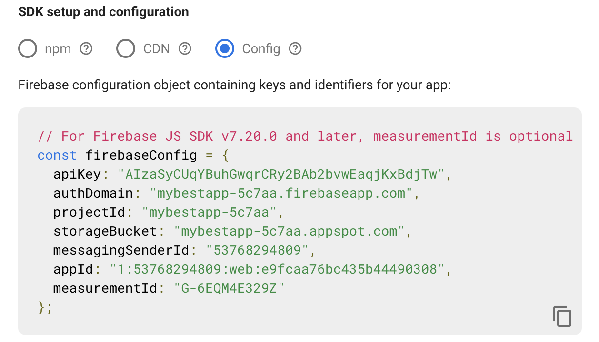

# Firebase

Firebase is a platform made by google to provide backend as a service in the cloud. Firebase offers us most of what we need from a backend such as Database, Authentication , analytics and others.

https://rnfirebase.io/ has a really good documentation regarding React native and Firebase.

Here we will create an app and will call it `My Best App`

## Firebase Setup

1. First of, go to https://firebase.google.com/ and create a new account for yourself.
2. Click Add Project and set a proper name.
3. Enable google analytics
4. Select the country, accept the terms and press `Create project`
5. Start by adding apps to firebase that represents your app for different platforms. I will go with iOS first and then web .

   

6. Click Web and put your app's name

   

   If you want your webApp to be hosted in firebase then you can check that checkbox. Otherwise you are good to go .

7. They will provide you with some configuration snippet that we will get to it later. Press Continue to console .
8. Now that you are at console. click `+ Add app` to add our iOS app
9. Fill needed info for your ios app , you will need to decide what is your bundle id will be at this level.

   

10. Keep press next till you go back to your console. We will use the config file later.

11. Go to Authentication and press `Get started`
12. Go to Firestore Database and press `Create Database`
13. Select \*Start in **test mode\***
14. Select the location near your users (Better to put it in europe to avoid GDPR issues)
15. Press Enable

16. With firestore being created, lets create our Realtime Database by following similar steps as the firestore.

Now that we have finished our firebase setup lets start setting our app .

## App Setup

1. Create a new empty typescript expo app

```
expo init MyBestApp
```

2. Go back to firebase console. click project settings

   

3. Go to your ios App from the `Your apps` section. Download `GoogleService-info.plist` and place it at the root folder of your expo project.

4. Go to `app.json` , search for `ios` and add the following config

```json
 "ios": {
      "bundleIdentifier": "com.fakecompany.mybestapp",
      "googleServicesFile": "./GoogleService-Info.plist"
    }
```

Pay attention that the `bundleIdentifier` should be the exact BundleId of your ios app. and notice that googleServicesFile should point to where the file you downloaded earlier is located.

5. Create a file `firebase.ts`
6. On your project settings in firebase console. Find the config for your web app. Then copy the content from `Config` And place it inside `firebase.ts`

   

7. If we are going to make an app for Web too, then lets head to `app.json` and try to find `web` and add the following

<span class="note">MAKE SURE YOU PLACE THE RIGHT VALUES </span>

## Initializing Firebase from App

1. `expo install firebase`
2. `expo install expo-firebase-analytics`
3. Go to `firebase.ts` as it should now contain `firebaseConfig` from previous steps.
4. add the following code to your firebase

```ts
import { FirebaseApp, initializeApp } from "firebase/app";

var app: FirebaseApp;
const firebaseConfig = {
  /* all configs*/
};

export const initFirebase = () => {
  app = initializeApp(firebaseConfig);
};
```

5. Now you can call `initFirebase` from an early stage of your app.

## Analytics

Analytics are used to see how users interact with your app, which features they use the most, and which screens they navigate to.
Such information is useful to see which features are being used the most , and which features are less fortunate to take a decision for them if we are going to keep them or not.

We can use the library, `expo-firebase-analytics`, as it is and as follows :

```ts
import * as Analytics from "expo-firebase-analytics";
Analytics.setCurrentScreen(screenName);
Analytics.logEvent(eventName, props);
```

Note that `eventName` should contain 1 to 40 alphanumeric characters or underscores. The name must start with an alphabetic character.

## RTDB

Realtime Database is a simple database that gets updated and read instantly.
When its get updated, it triggers an event on firebase sdk and thus the client listening gets updated instantly.

In our app we are going to score for a student and updated it directly to the database. In the same time the app will subscribe for that score to see if the value will get updated in the app when we change it directly from the database

insert the following snippet to `firebase.ts`

```ts
export const setHighScore = (userId: string, score: number) => {
  const db = getDatabase();
  const reference = ref(db, "users/" + userId);
  set(reference, {
    highScore: score,
  });
};

export const subscribeToUserRTDB = (
  userId: string,
  callback: (score: number) => void
): Unsubscribe => {
  const db = getDatabase();
  const reference = ref(db, "users/" + userId);
  return onValue(reference, (snapshot) => {
    try {
      callback(snapshot.val().score);
    } catch (error) {
      setScoreRTDB(userId, 0);
    }
  });
};
```

Lets take a look at `setHighScore`. It gets the database using `getDatabase()`, then it takes a reference to where the data will be stored using `ref()` function, and sets a new value for it using `set()` function.

Lets take a look at `subscribeUser`. It tries to reach a specific user in the database and subscribe to its changes using `onValue` .
There is a try catch here. This is in case the user does not exist we catch the error and handle it . In this case we are just creating a record for it in the database with default values.
Notice that it returns `Unsubscribe` which is a function that can be used to end the connection with the database.

The following snippet shows how we use all the above

```ts
export default function App() {
  const [score, setScore] = React.useState(0);
  initFirebase();

  React.useEffect(() => {
    setCurrentScreen("Main Screen");
    const unsubscribe = subscribeUser(
      userId: "Adam",
      onUpdate: (score) => {
        setScore(score);
      }
    );

    return () => {
      if (unsubscribe) {
        unsubscribe();
      }
    };
  }, []);

  return (
    <View style={styles.container}>
      <Text>The score is {score}</Text>
      <Button
        title="Add 1 to Score"
        onPress={() => {
          logEvent("score_set", { username: "Adam", score: score });
          setHighScore("Adam", score + 1);
        }}
      />
    </View>
  );
}
```

## Firestore

Firestore is the second generation of the Realtime database , and it will probably replace it at some point.

Recently they have upgraded thier SDK so it is hard at this point to find documentations regarding React Native. So the best way to do that is to check their official documentation.
Read more https://firebase.google.com/docs/firestore

In away, from a user perspective, Firestore and RTDB have the same concept regarding subscribing and setting data to database. You need to locate the record you want to subscribe or set its value before the actual subscribing and setting values .

```ts
export const setScore = (userId: string, score: number) => {
  const db = getFirestore();
  const reference = doc(db, "users", userId);
  setDoc(reference, { score: score });
};
```

To subscribe for changes in record

```ts
export const subscribeToUser = (
  userId: string,
  callback: (score: number) => void
): UnsubscribeFS => {
  const db = getFirestore();
  const reference = doc(db, "users", userId);
  return onSnapshot(reference, (snapshot) => {
    const data = snapshot.data() as { score: number };
    if (data) callback(data.score);
    else setScoreFS(userId, 0);
  });
};
```

What makes Firestore special is the support of offline mode, if your app went offline it can still cache the data and then it would be synced automatically when your phone gets online.

To enable offline support on Expo Go:

1. `yarn add expo-firestore-offline-persistence`
2. `expo install expo-sqlite indexeddbshim`
3. In firebaseService.ts

```ts
import "expo-firestore-offline-persistence"; //Add this import
import {
  doc,
  enableIndexedDbPersistence,
  getFirestore,
  onSnapshot,
  setDoc,
  Unsubscribe,
} from "firebase/firestore";
export const fbInit = () => {
  app = initializeApp(firebaseConfig);
  enableIndexedDbPersistence(getFirestore()); //Add this line
};
```
